# The Daily Reflection Tree — Visual Diagram

```mermaid
graph TD
    START["🌙 START<br/>Good evening..."]
    A1_INTRO["↳ BRIDGE<br/>First lens: how you moved through today"]
    
    START --> A1_INTRO
    A1_INTRO --> A1_OPEN

    subgraph AXIS1["🔵 Axis 1 — Locus of Control (Victim ↔ Victor)"]
        A1_OPEN["❓ A1_OPEN<br/>Describe today in one word?<br/>Productive | Tough | Mixed | Draining"]
        A1_D1{{"⚙ A1_D1<br/>Route on answer"}}
        A1_Q_HIGH["❓ A1_Q_AGENCY_HIGH<br/>What made the difference?<br/>4 options (2 int / 2 ext)"]
        A1_Q_LOW["❓ A1_Q_AGENCY_LOW<br/>Where did your mind go?<br/>4 options (2 int / 2 ext)"]
        A1_D2H{{"⚙ A1_D2_HIGH<br/>Route on signal"}}
        A1_D2L{{"⚙ A1_D2_LOW<br/>Route on signal"}}
        A1_Q_SET["❓ A1_Q_SETBACK<br/>What did you do with a setback?<br/>4 options (2 int / 2 ext)"]
        A1_Q_CHO["❓ A1_Q_CHOICE<br/>Can you spot a moment of choice?<br/>4 options (2 int / 2 ext)"]
        A1_D3{{"⚙ A1_D3<br/>Dominant axis1"}}
        A1_R_INT["💡 A1_R_INTERNAL<br/>You stayed in the driver's seat"]
        A1_R_EXT["💡 A1_R_EXTERNAL<br/>Your agency was there, even if hidden"]
        A1_R_MIX["💡 A1_R_MIXED<br/>Moments of both steering and drifting"]

        A1_OPEN --> A1_D1
        A1_D1 -->|"Productive / Mixed"| A1_Q_HIGH
        A1_D1 -->|"Tough / Draining"| A1_Q_LOW
        A1_Q_HIGH --> A1_D2H
        A1_Q_LOW --> A1_D2L
        A1_D2H -->|internal| A1_Q_SET
        A1_D2H -->|external| A1_Q_CHO
        A1_D2L -->|internal| A1_Q_SET
        A1_D2L -->|external| A1_Q_CHO
        A1_Q_SET --> A1_D3
        A1_Q_CHO --> A1_D3
        A1_D3 -->|"internal dominant"| A1_R_INT
        A1_D3 -->|"external dominant"| A1_R_EXT
        A1_D3 -->|"tied"| A1_R_MIX
    end

    BRIDGE_12["↳ BRIDGE 1→2<br/>From how you handled it... to what you gave"]
    A1_R_INT --> BRIDGE_12
    A1_R_EXT --> BRIDGE_12
    A1_R_MIX --> BRIDGE_12

    subgraph AXIS2["🟢 Axis 2 — Orientation (Entitlement ↔ Contribution)"]
        A2_OPEN["❓ A2_OPEN<br/>One interaction — giving or expecting?<br/>4 options (2 contrib / 2 entitle)"]
        A2_D1{{"⚙ A2_D1<br/>Route on signal"}}
        A2_Q_GIVE["❓ A2_Q_GIVE<br/>What was driving the giving?<br/>4 options (3 contrib / 1 entitle)"]
        A2_Q_EXP["❓ A2_Q_EXPECT<br/>What was underneath that feeling?<br/>4 options (1 contrib / 3 entitle)"]
        A2_D2{{"⚙ A2_D2<br/>Dominant axis2"}}
        A2_Q_MC["❓ A2_Q_MIRROR_CONTRIB<br/>Did you wish someone would give to you?<br/>4 options (2 contrib / 2 entitle)"]
        A2_Q_ME["❓ A2_Q_MIRROR_ENTITLE<br/>Was there a moment you gave freely?<br/>4 options (2 contrib / 2 entitle)"]
        A2_D3{{"⚙ A2_D3<br/>Dominant axis2"}}
        A2_R_CON["💡 A2_R_CONTRIBUTION<br/>Your giving compounds quietly"]
        A2_R_ENT["💡 A2_R_ENTITLEMENT<br/>Your effort mattered, said or unsaid"]
        A2_R_MIX["💡 A2_R_MIXED<br/>Both giving and wanting — honest"]

        A2_OPEN --> A2_D1
        A2_D1 -->|contribution| A2_Q_GIVE
        A2_D1 -->|entitlement| A2_Q_EXP
        A2_Q_GIVE --> A2_D2
        A2_Q_EXP --> A2_D2
        A2_D2 -->|"contrib dominant"| A2_Q_MC
        A2_D2 -->|"entitle dominant"| A2_Q_ME
        A2_Q_MC --> A2_D3
        A2_Q_ME --> A2_D3
        A2_D3 -->|"contrib dominant"| A2_R_CON
        A2_D3 -->|"entitle dominant"| A2_R_ENT
        A2_D3 -->|"tied"| A2_R_MIX
    end

    BRIDGE_12 --> A2_OPEN

    BRIDGE_23["↳ BRIDGE 2→3<br/>From what you gave... to who was in the picture"]
    A2_R_CON --> BRIDGE_23
    A2_R_ENT --> BRIDGE_23
    A2_R_MIX --> BRIDGE_23

    subgraph AXIS3["🟠 Axis 3 — Radius (Self-Centrism ↔ Altrocentrism)"]
        A3_OPEN["❓ A3_OPEN<br/>Today's biggest challenge — who comes to mind?<br/>4 options (2 self / 2 others)"]
        A3_D1{{"⚙ A3_D1<br/>Route on signal"}}
        A3_Q_EXP["❓ A3_Q_EXPAND<br/>What did you notice about others?<br/>4 options (3 others / 1 self)"]
        A3_Q_IN["❓ A3_Q_INWARD<br/>Was anyone else carrying something?<br/>4 options (1 others / 3 self)"]
        A3_D2{{"⚙ A3_D2<br/>Dominant axis3"}}
        A3_Q_TO["❓ A3_Q_TOMORROW_OUT<br/>What's the right next step?<br/>4 options (3 others / 1 self)"]
        A3_Q_TI["❓ A3_Q_TOMORROW_IN<br/>What slight shift might you try?<br/>4 options (3 others / 1 self)"]
        A3_D3{{"⚙ A3_D3<br/>Dominant axis3"}}
        A3_R_W["💡 A3_R_WIDE<br/>Your radius extends beyond yourself"]
        A3_R_N["💡 A3_R_NARROW<br/>Turning outward eases the weight"]
        A3_R_G["💡 A3_R_GROWING<br/>You're at the edge of growth"]

        A3_OPEN --> A3_D1
        A3_D1 -->|others| A3_Q_EXP
        A3_D1 -->|self| A3_Q_IN
        A3_Q_EXP --> A3_D2
        A3_Q_IN --> A3_D2
        A3_D2 -->|"others dominant"| A3_Q_TO
        A3_D2 -->|"self dominant"| A3_Q_TI
        A3_Q_TO --> A3_D3
        A3_Q_TI --> A3_D3
        A3_D3 -->|"others dominant"| A3_R_W
        A3_D3 -->|"self dominant"| A3_R_N
        A3_D3 -->|"tied"| A3_R_G
    end

    BRIDGE_23 --> A3_OPEN

    CLOSING["💡 CLOSING<br/>Let's put today together"]
    SUMMARY["📋 SUMMARY<br/>Your three-axis reflection"]
    ENDNODE["🌙 END<br/>See you tomorrow"]

    A3_R_W --> CLOSING
    A3_R_N --> CLOSING
    A3_R_G --> CLOSING
    CLOSING --> SUMMARY
    SUMMARY --> ENDNODE

    classDef question fill:#1a2744,stroke:#d4a574,color:#e8e2d8
    classDef decision fill:#0d1220,stroke:#6b6158,color:#a09888
    classDef reflection fill:#1a1a2e,stroke:#8ea4bf,color:#a8b4c8
    classDef bridge fill:#0d1220,stroke:#555,color:#777
    classDef special fill:#1a2020,stroke:#d4a574,color:#e8b86d

    class A1_OPEN,A1_Q_HIGH,A1_Q_LOW,A1_Q_SET,A1_Q_CHO question
    class A2_OPEN,A2_Q_GIVE,A2_Q_EXP,A2_Q_MC,A2_Q_ME question
    class A3_OPEN,A3_Q_EXP,A3_Q_IN,A3_Q_TO,A3_Q_TI question
    class A1_D1,A1_D2H,A1_D2L,A1_D3 decision
    class A2_D1,A2_D2,A2_D3 decision
    class A3_D1,A3_D2,A3_D3 decision
    class A1_R_INT,A1_R_EXT,A1_R_MIX reflection
    class A2_R_CON,A2_R_ENT,A2_R_MIX reflection
    class A3_R_W,A3_R_N,A3_R_G reflection
    class A1_INTRO,BRIDGE_12,BRIDGE_23 bridge
    class START,CLOSING,SUMMARY,ENDNODE special
```

## Legend

| Symbol | Node Type | Count |
|--------|-----------|-------|
| ❓ | Question (user picks an option) | 15 |
| ⚙ | Decision (invisible routing) | 10 |
| 💡 | Reflection (insight shown to user) | 10 |
| ↳ | Bridge (axis transition) | 3 |
| 📋 | Summary | 1 |
| 🌙 | Start / End | 2 |
| **Total** | | **41** |

## Path Count

Each axis has approximately 3 reflection endpoints (internal/external/mixed × contribution/entitlement/mixed × wide/narrow/growing), yielding **27 unique end-state combinations** and many more distinct conversation paths through the tree.
